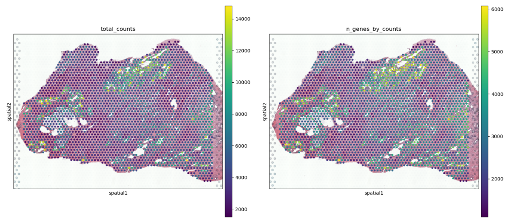
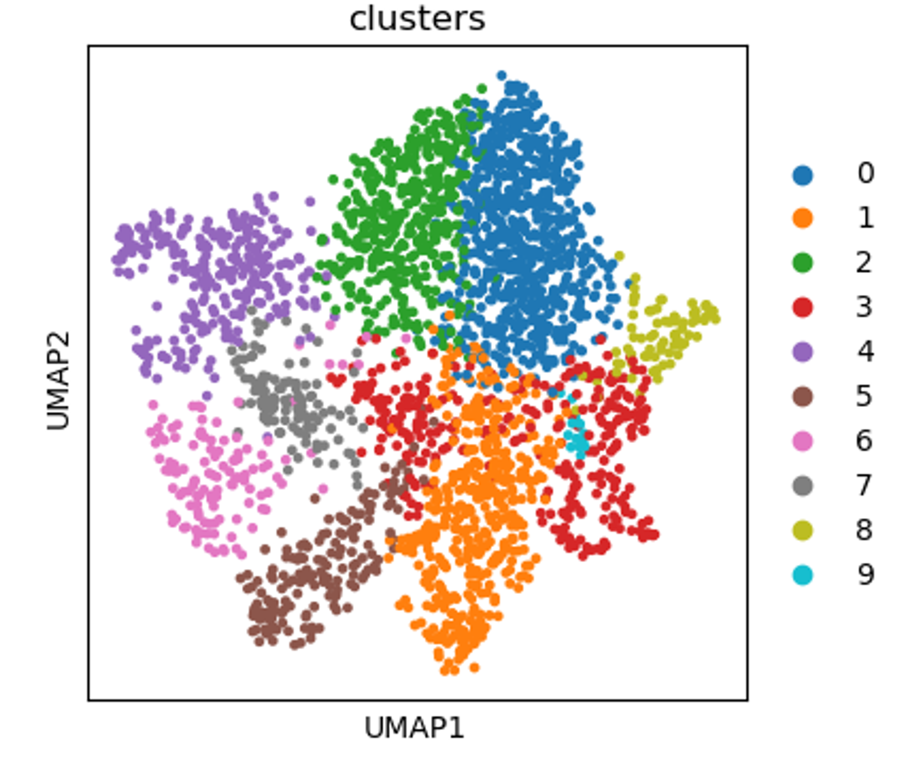
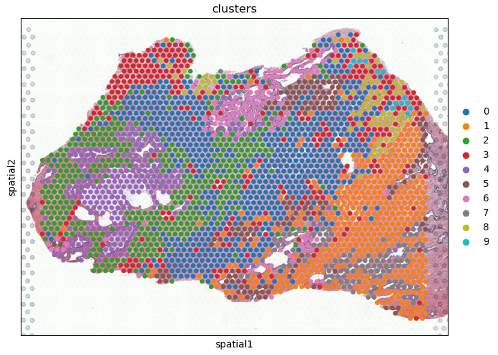
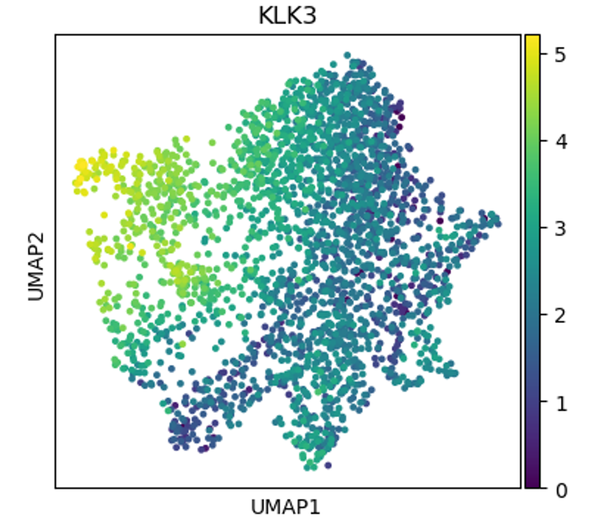
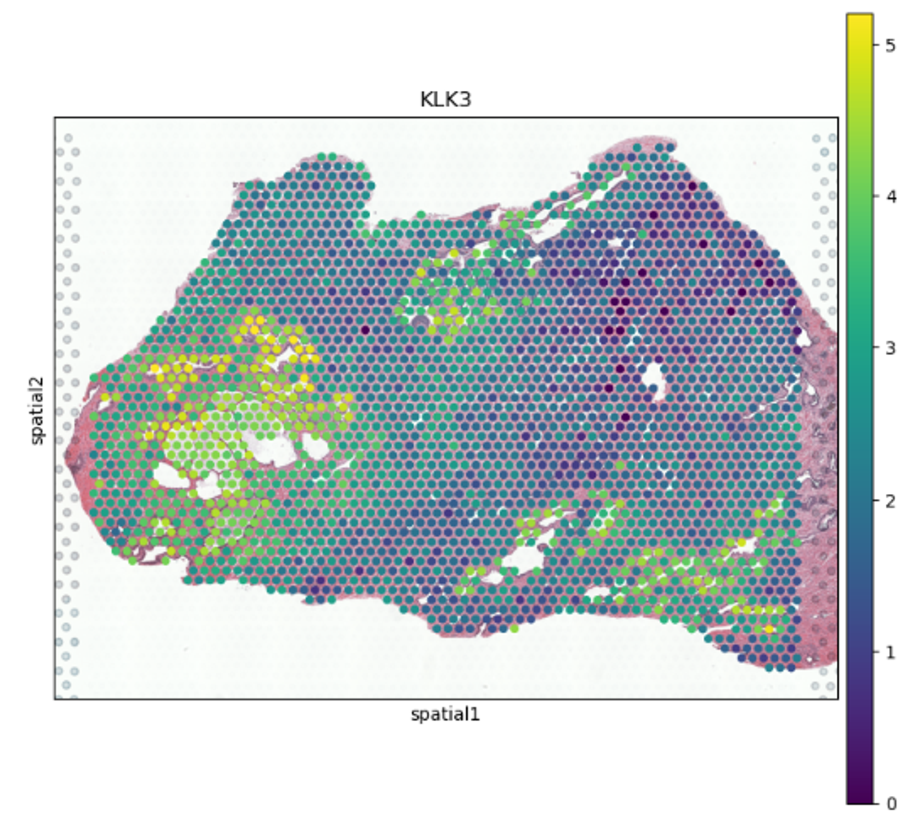

# Tracing Prostate-Specific Antigen-producing Cells with Visium Spatial Gene Expression

## Introduction

The introduction of spatial transcriptomics technologies has marked a significant leap forward in our ability to dissect the complex molecular landscapes of biological tissues. These cutting-edge approaches merge the detailed spatial information of histological analysis with the comprehensive expression profiles obtained through transcriptomics, offering an unprecedented view of how genes are expressed across different tissue regions. My fascination lies squarely with these innovative technologies—their mechanisms, capabilities, and the transformative impact they promise for biological research.

Visium Spatial Gene Expression, developed by 10X Genomics, is one of the most widely used spatial transcriptomics technologies. The technology utilizes uniquely designed slides with thousands of oligo-dT capture spots corresponding to known coordinates. When a tissue section is placed onto these slides and permeabilized, mRNA from the tissue binds to these spots, enabling the subsequent sequencing of these transcripts. Each spot thus becomes a data point for the expression of thousands of genes and their precise location within the tissue. The output of a Visium experiment is a rich dataset that includes both a high-resolution image of the stained tissue section and a comprehensive gene expression profile for each spot, effectively providing a detailed gene expression map of the entire tissue section. It is important to note that each spot is multiple times bigger than an average cell; thus, Visium does not provide a single-cell resolution. 

This dual output bridges a crucial gap in biomedical research. For the first time, we can see not only the landscape of gene expression across a tissue but also the exact spatial context of this expression. This means that for diseases like cancer, where the localization and microenvironment could significantly influence disease progression and treatment response, Visium offers insights of unprecedented detail and relevance. 

In the spotlight of my current exploration is the application of Visium Spatial Gene Expression to study the distribution of Prostate-Specific Antigen (PSA) producing cells within the prostate gland. The prostate gland emerges as a critical player within the male reproductive system. Among its various functions, the production of Prostate-Specific Antigen (PSA), also known as kallikrein-related peptidase 3 (KLK3), is of paramount interest to researchers and clinicians alike. PSA, a serine protease, not only plays a critical role in semen liquefaction but also serves as a key biomarker for prostate health, particularly in the diagnosis and monitoring of prostate cancer. 

Visium's output allows us to pinpoint the regions within the tissue where PSA expression is most active, providing a spatial dimension to our understanding of gene expression that was previously out of reach. This deep dive into the spatial transcriptomics of the prostate gland opens new avenues for understanding tissue architecture and function, offering a glimpse into the future of molecular biology and disease diagnostics. This paper presents a comprehensive walkthrough of the Visium data analysis and results.

## Methods

### Dataset

I used a publicly available spatial gene expression dataset of normal human prostate tissue. This dataset, generously provided by 10x Genomics, leverages their pioneering Visium Spatial Gene Expression technology. The sample, sourced from FFPE (Formalin-Fixed Paraffin-Embedded) human prostate tissue, was obtained through Indivumed Human Tissue Specimens.

### Data Analysis

After acquiring the dataset, I turned to Scanpy, a Python-based library designed to analyze single-cell RNA sequencing data, which has been adapted for Visium Spatial Gene Expression datasets. Scanpy's comprehensive toolkit allowed for the efficient preprocessing, analysis, and visualization of the spatial transcriptomics data.

**Preprocessing**

To load Visium data into Scanpy, I used the `scanpy.read_visium` function, which converts the data into an Anndata object containing counts, images, and spatial coordinates. 

I then calculate the quality control metrics, such as the number of counts, the number of genes by count, and the percentage of mitochondrial genes. I applied filters to exclude spots with an unusually high or low number of detected genes and UMIs, as well as extraordinarily high mitochondrial genes. Quality control is crucial to ensure that data used for downstream analysis is free from technical artifacts and biological outliers.

I performed normalization to level the playing field across spots by adjusting for differences in sequencing depth. I employed logarithmic transformation to stabilize variance across the dataset. I then conducted data scaling, which centered the gene expression data and reduced the influence of genes with extreme expression levels, allowing for more equitable comparisons across genes.

**Processing**

The preprocessed data is then subject to feature engineering, where highly variable genes are identified. Therefore, these genes are often the most informative and are selected for dimensionality reduction via Principal Component Analysis (PCA). PCA reduces the data's complexity, distilling it into its most informative components and making it more amenable for the next steps of analysis.

Upon dimensionality reduction, a neighborhood graph of spots is constructed based on their PCA-reduced expression profiles. This graph forms the basis for subsequent clustering, which groups spots based on their expression similarities, unveiling the underlying heterogeneity within the dataset. The graph's structure is further refined using algorithms such as Uniform Manifold Approximation and Projection (UMAP) for visualization.

**Clustering and Annotation**

I performed clustering using the Leiden algorithm implemented in Scanpy to identify distinct expression patterns within the prostate tissue. This approach grouped spots based on similarity in gene expression, hinting at potential functional zones within the tissue. It is important to note that these spots are bigger than cells and thus may contain more than one cell type. Each cluster was then annotated based on known markers or differential expression analysis to identify regions of interest, such as those rich in PSA-producing cells.

**Visualizing Spatial Patterns**

Leveraging Scanpy's spatial plotting functions, I visualized the distribution of clusters and PSA expression across the tissue section. The `scanpy.pl.spatial` function provided a direct way to overlay gene expression data onto high-resolution tissue images, illustrating the spatial organization of gene expression and highlighting areas with elevated PSA levels.

## Results

My investigation into the spatial gene expression within human prostate tissue yielded insightful results using Visium.

**Cell Density and Gene Expression Heterogeneity**
Figure 1 presents two spatial distribution plots derived from Visium Spatial Transcriptomics data of human prostate tissue. Each dot represents a distinct spot on the Visium slide corresponding to a specific tissue area, overlaid on a hematoxylin and eosin (H&E) stained section. 

On the left, the total counts plot illustrates the overall transcriptional activity at each spot. The color intensity indicates the total number of transcripts (or reads) detected, with warmer colors (yellow-green) denoting higher counts, suggesting regions with higher overall gene expression or cellular density.

On the right, the plot of the number of genes by counts shows the diversity of gene expression at each spot. The color scale reflects the number of unique genes detected at each spot, with warmer colors (yellow-green) highlighting spots with a higher diversity of gene expression.

Together, these plots provide insight into the quantity and complexity of gene expression across different prostate tissue regions. They revealed a heterogeneous expression profile across the sampled tissue spots. Regions with high total counts and gene diversity might correspond to areas with a high density of cells or a high level of transcriptional activity, potentially indicating biologically active or significant zones within the tissue for further study. These regions, mainly around the ducts, align with the known histology of the tissue as they are rich in secretory cells.

Figure 1: Transcriptional Activity across Human Prostate Tissue. Left: Total transcript counts per spot. Right: Unique gene counts per spot overlaid on H&E staining, indicating spatial expression heterogeneity.

 

**Spatial Clustering of Gene Expression**

Further analysis delineated distinct spatial clusters within the tissue, as shown in the UMAP (Figure 2) and corresponding histological plots (Figure 3). The cluster plot represents the result of a Leiden clustering algorithm, identifying ten distinct clusters (labeled 0-9) based on gene expression patterns. Each individual point is not a cell but a region or a spot in the tissue. Thus, these clusters represent distinct microenvironments or niches within the prostate tissue, each characterized by unique gene expression profiles that likely correspond to different cellular compositions or states of cellular activity. When mapped back onto the tissue image, these clusters exhibit a clear spatial organization, suggesting that gene expression is not random but structured within the tissue architecture.

Figure 2: UMAP Visualization of Gene Expression Clusters in Prostate Tissue. Each point represents a spot categorized by a Leiden-derived cluster, indicating gene expression similarities.

Figure 3: Histological Mapping of Spatial Gene Expression Clusters. Leiden clusters from Visium data are overlaid onto an H&E-stained image of prostate tissue, showing the spatial distribution of gene expression.

**Identification of PSA Production**

Focusing on Prostate-Specific Antigen (PSA), or KLK3, expression, the analysis pinpointed regions within the prostate tissue characterized by higher expression levels of this critical biomarker. The UMAP and spatial plots provide a compelling illustration of KLK3 expression across the prostate tissue.

The UMAP plot (Figure 4) visualizes the differential expression of KLK3 among the identified clusters, revealing that its expression is not evenly distributed but is concentrated in clusters 4 and 7. These clusters appear to be hotspots for KLK3 expression.

Moving to the spatial plot (Figure 5), I overlay this expression data onto the actual tissue architecture, where the expression levels of KLK3 are superimposed on an image of the tissue section. Here, we see the expression pattern of KLK3 correlating with the physical locations that likely represent the epithelial luminal cells around the ducts, which are the secretory powerhouses of the prostate. These cells are known to be the leading producers of PSA, which aligns with the regions of elevated expression noted in the analysis.

Figure 4: UMAP Plot Highlighting KLK3 Gene Expression Hotspots in Prostate Tissue.

Figure 5: Histological View of KLK3 Expression Correlated with Prostate Gland Ductal Structure.

**Considering Alternative Hypotheses**

In assessing the significance of regions with high KLK3 expression within the prostate tissue, I proposed an alternative hypothesis: the observed high expression of KLK3 might reflect areas of overall high transcriptional activity rather than specific zones of PSA production. To investigate this hypothesis, I conducted a comparative analysis focusing on the expression patterns of other cell-type-specific markers.

The expression of FBLN1, a fibroblast marker gene, was mapped across the prostate tissue sections. The resulting visualization, as shown in the accompanying figure, indicates that FBLN1 expression is predominantly localized in regions distinct from those showing high KLK3 expression. This suggests that the high expression of KLK3 is not a mere artifact of general transcriptional activity, as fibroblast-rich areas do not overlap with the KLK3 enrichment zones.

Furthermore, the expression of TPM2, a marker for smooth muscle cells, was also analyzed. The spatial expression pattern of TPM2 revealed enrichment in regions different from both the high KLK3 expression areas and the fibroblast-marked territories. This further supports the specificity of the KLK3 expression to specific cell types within the prostate tissue and refutes the hypothesis that KLK3 expression is solely a consequence of heightened global transcriptional activity.

Figure 6: Spatial Distribution of FBLN1 Expression in Prostate Tissue. The hexagon overlay indicates the presence of fibroblasts with FBLN1 expression, showing a distinct pattern from KLK3-rich areas.

Figure 7: Spatial Localization of TPM2 Expression in Prostate Tissue. This plot illustrates regions rich in smooth muscle cells, marked by TPM2 expression, separate from the high KLK3 expression zones.

These observations provide evidence against the hypothesis that the high expression levels of KLK3 are due to overall transcriptional upregulation within those tissue areas. Instead, the distinct spatial expression profiles of cell-type-specific markers underscore the presence of specialized niches within the prostate gland. Such niches harbor cell populations with unique transcriptional signatures related to their specific functions, such as PSA production by epithelial luminal cells, structural support by fibroblasts, and contractility provided by smooth muscle cells.

## Discussion

The elucidation of Prostate-Specific Antigen (PSA) production locations within the prostate gland by Visium Spatial Gene Expression technology, as detailed in this study, not only corroborates with existing anatomical and histological insights but also enriches our understanding with its high-resolution spatial context. This discussion integrates these findings with traditional knowledge about the prostate gland's cellular organization, offering implications for future research and clinical applications in prostate health and disease, particularly prostate cancer.

### **Correlation with Established Prostate Gland Anatomy**

The traditional understanding of the prostate gland's structure, as highlighted by Denmeade and Isaacs, describes a complex tubuloalveolar architecture with distinct epithelial and stromal compartments. These authors elucidate the acinar structure lined by glandular epithelial cells responsible for producing prostate fluid and markers such as PSA. This perfectly aligns with our spatial transcriptomics data that localized PSA production primarily to the epithelial luminal cells surrounding the ducts of the prostate gland.

Our study's spatial resolution further refines this understanding by precisely mapping these glandular epithelial cells within the prostate anatomy, confirming their critical role in PSA secretion as suggested by the existing literature. Such detailed mapping underscores the utility of advanced spatial transcriptomics in verifying and expanding upon classical histology.

### **Enhancing Diagnostic and Therapeutic Approaches in Prostate Cancer**

Diagnostic Precision

Current PSA screening for prostate cancer relies on blood tests that measure PSA levels, which can be elevated due to a variety of factors not exclusive to cancer. The spatial data from this study propose a potential shift towards biopsy-based diagnostic techniques that could utilize PSA distribution patterns as a more direct indicator of cancerous changes within the gland. By correlating specific PSA-rich zones identified via Visium technology with cancer presence, it might be possible to enhance the specificity of prostate cancer diagnostics.

Targeted Therapeutic Development

The ability to visualize and quantify gene expression at specific tissue locations enables the identification of potential targets for localized treatment strategies, such as precision drug delivery or focal therapy. This could be particularly beneficial in managing localized prostate cancer, where treatment can be directly administered to PSA-expressing cells, potentially increasing efficacy while minimizing systemic side effects.

### Future Research Directions

Integrating Spatial and Single-Cell Transcriptomics

Future studies could integrate the broad-view mapping capabilities of spatial transcriptomics with the high-resolution cellular detail provided by single-cell RNA sequencing (scRNA-seq) to gain even deeper insights into the cellular microenvironment's influence on PSA production and prostate cancer progression. This approach would allow researchers to overlay the spatial patterns of gene expression identified using Visium technology with single-cell resolution data. The combination can pinpoint specific cell types and states driving disease processes and response to therapy within the mapped regions, providing a more nuanced understanding of prostate pathology at the single-cell level.

Comparative Analysis of Cancerous and Normal Prostate Tissues

Another promising direction involves the comparative analysis of spatial transcriptomic data from prostate cancer tissues versus normal tissues, like the ones studied here. By directly comparing these datasets, researchers can identify spatial and molecular differences that highlight cancer-specific changes in gene expression, cellular composition, and microenvironment interactions. This comparison could uncover novel oncogenic signatures and potentially reveal emergent properties of the tumor microenvironment that are not present in normal tissue, aiding in identifying new therapeutic targets.

## Conclusion
The exploration of spatial gene expression within the prostate gland using Visium Spatial Gene Expression has demonstrated the remarkable specificity of the production of Prostate-Specific Antigen (PSA), a prostate cancer marker, at the cellular level. By leveraging advanced transcriptomic technology and sophisticated analytical methods, this study has revealed distinct patterns of gene expression within normal human prostate tissue, highlighting areas with elevated PSA production that correspond to the locations of secretory epithelial cells.

The comparison of PSA expression with the distribution of other cell-type-specific markers—FBLN1 for fibroblasts and TPM2 for smooth muscle cells—has provided further evidence to refute the hypothesis that the high expression of PSA is simply due to overall high transcriptional activity. Instead, each marker's distinct spatial expression patterns strongly suggest the presence of specialized niches within the prostate tissue, each associated with unique cell types and functions. These findings are critical for understanding the functional architecture of the prostate gland and may have significant implications for the diagnosis and treatment of prostate-related conditions.

This study showcases the power of spatial transcriptomics in uncovering the hidden complexities of tissue structure and gene expression. As I conclude, it is clear that technologies like Visium Spatial Gene Expression are invaluable tools for the biomedical research community, allowing us to trace the intricate details of cellular function within their native tissue environments. Such technologies’ continued development and application will undoubtedly enhance our understanding of complex biological systems and pave the way for personalized and precise medical interventions.

## Data and Resources

The spatial gene expression dataset analyzed in this study was acquired from 10X Genomics’ public Visium datasets [here](https://www.10xgenomics.com/datasets/normal-human-prostate-ffpe-1-standard-1-3-0). Comprehensive analysis scripts and related resources are available on this project’s GitHub repository.

## Bibliography

Denmeade, S. R., & Isaacs, J. T. (2003). Cellular Organization of the Normal Prostate. In D. W. Kufe, R. E. Pollock, R. R. Weichselbaum, et al. (Eds.), *Holland-Frei Cancer Medicine* (6th ed.). Hamilton, ON: BC Decker. Retrieved from https://www.ncbi.nlm.nih.gov/books/NBK14022/

Henry, G. H., Malewska, A., Joseph, D. B., Malladi, V. S., Lee, J., Torrealba, J., Mauck, R. J., Gahan, J. C., Raj, G. V., Roehrborn, C. G., Hon, G. C., MacConmara, M. P., Reese, J. C., Hutchinson, R. C., Vezina, C. M., & Strand, D. W. (2018). A cellular anatomy of the normal adult human prostate and prostatic urethra. *Cell Reports*, *25*(12). https://doi.org/10.1016/j.celrep.2018.11.086

Hong, S. K. (2014). Kallikreins as biomarkers for prostate cancer. *BioMed Research International*, *2014*, 1–10. https://doi.org/10.1155/2014/526341 

Ittmann, M. (2017). Anatomy and histology of the human and murine prostate. *Cold Spring Harbor Perspectives in Medicine*, *8*(5). https://doi.org/10.1101/cshperspect.a030346

Koistinen, H., Künnapuu, J., & Jeltsch, M. (2021). KLK3 in the regulation of angiogenesis—tumorigenic or not? *International Journal of Molecular Sciences*, *22*(24), 13545. https://doi.org/10.3390/ijms222413545 

*Spatial gene expression*. 10x Genomics. (n.d.). https://www.10xgenomics.com/products/spatial-gene-expression

*Spatial*. Scanpy. (n.d.). https://scanpy.readthedocs.io/en/stable/tutorials/spatial/index.html 
Yu, Q., Jiang, M., & Wu, L. (2022). Spatial Transcriptomics Technology in cancer research. *Frontiers in Oncology*, *12*. https://doi.org/10.3389/fonc.2022.1019111
